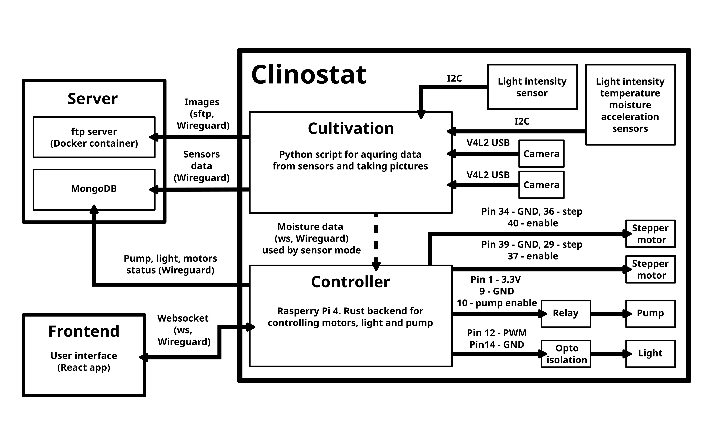

# Clinostat capsule

Unified repository for a dispersed clinostat system. Each submodule/dir has its own Readme.

## Requirements

MongoDB database and MongoDB Compass for inspecting the data. The database should run alongside a Docker container for images on the same device.

## Architecture
</img>

## Information
Additional information about the device can be found in article:

https://www.mdpi.com/2076-3417/14/20/9517

